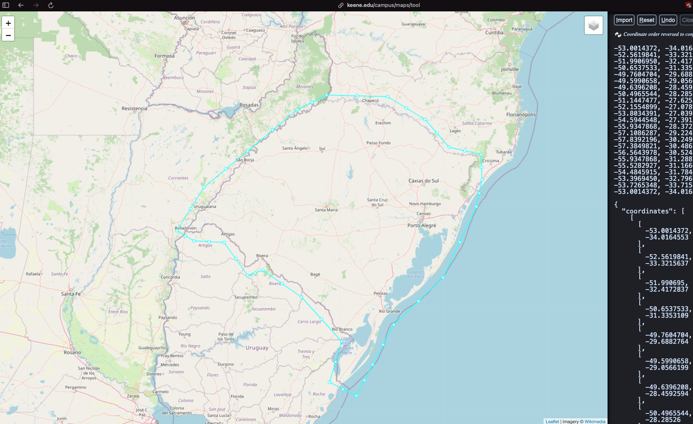
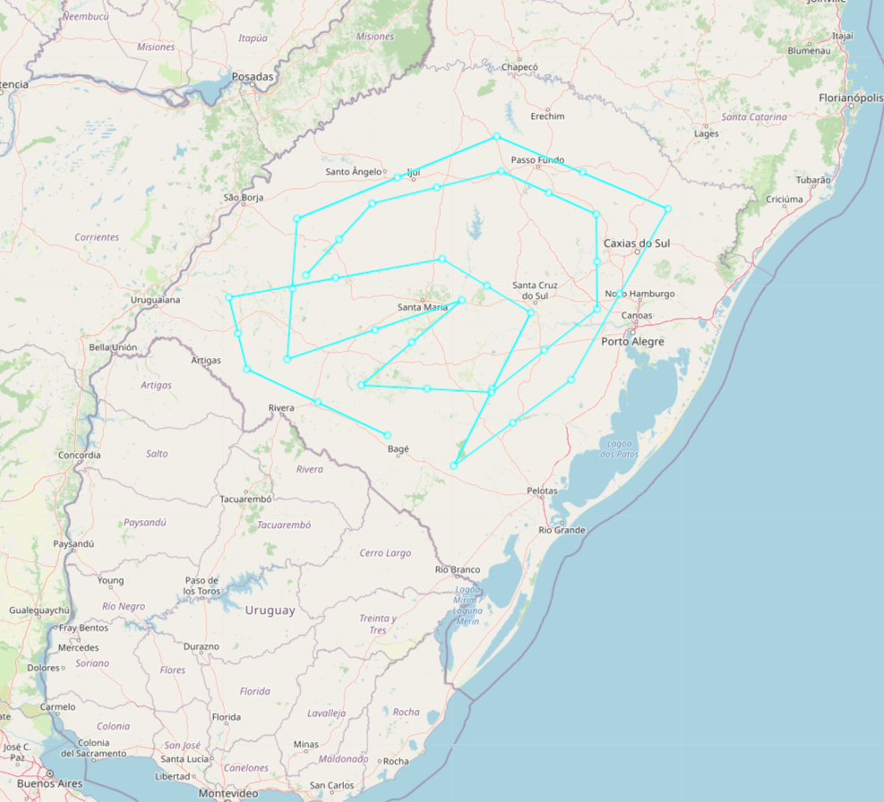

## Context and Problem Statement

To rule out any people trolling, we want to get the request coordinates from the user and then check if the coordinates are within the city of the state of Rio Grande do Sul.

## Decision Drivers

* The user must be within the city of the state of Rio Grande do Sul to be able to use the application.
* We won't be super worried about the accuracy of the coordinates, but we want to make sure that the user is within the city of the state of Rio Grande do Sul.

## Considered Options

- Considered area for Rio Grande do Sul

- Points for testing the validator

